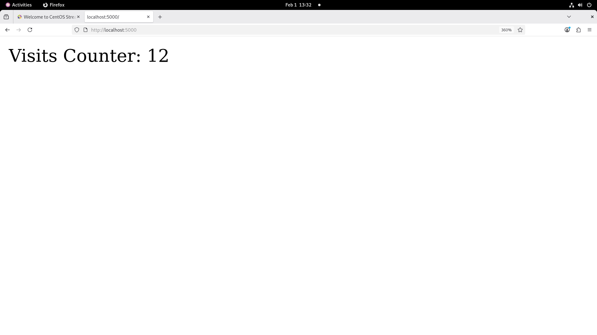

# Website Visits Counter 🚀

A simple Node.js application that counts website visits using **Express** and **Redis**.

Each page refresh increases the counter by 1.

---

## 📸 Screenshots

| Visit 12 | Visit 13 |
|---------|----------|
|  |  |

---

## 🛠️ Tech Stack

- Node.js
- Express.js
- Redis
- Docker
- Docker Compose

---

## ⚙️ How It Works

- The application listens on a specific port.
- Redis is used to store the number of visits.
- On each HTTP request:
  - The current counter value is fetched from Redis.
  - The value is displayed in the browser.
  - The counter is incremented by 1 and saved back to Redis.

---

## ▶️ Run Locally (Without Docker)

### Prerequisites
- Node.js
- Redis

### Steps

```bash
npm install
redis-server
npm start
